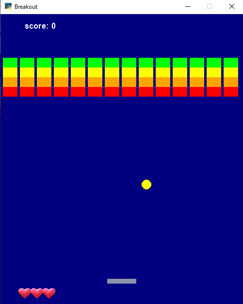

# Breakout Game
This game is written by **Python** with **arcade** Library
---
## Instruction:
- rocket move with **mouse** and **keyboard**
- If the ball goes out of the box, player loses one point
- If the ball exits the game screen three times(losing all three hearts)
the **game over** message will appear

